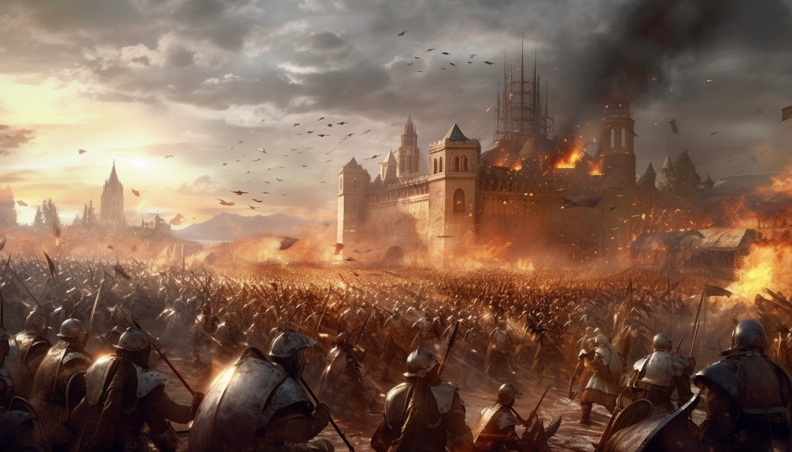

# Chaquer-RTS

Welcome to Chaquer-RTS, a fully on-chain game that promises an immersive real-time strategy experience on the blockchain.



## Table of Contents

- [Introduction](#introduction)
- [Features](#features)
- [GamePlay](#gameplay)
- [Getting Started](#getting-started)
- [Team Nakamo](#teamnakamo)

## Introduction

Chaquer-RTS is a groundbreaking on-chain game that leverages blockchain technology to provide a decentralized and transparent gaming experience. Dive into a world of strategy, resource management, and intense battles, all secured by the power of the blockchain.

## Features

- **Fully On-Chain:** Every aspect of the game, from in-game assets to player interactions, is stored on the blockchain, ensuring transparency and security.

- **Decentralized Gameplay:** Enjoy a truly decentralized gaming experience without the need for intermediaries. Your actions and assets are yours and yours alone.

- **Smart Contracts:** Smart contracts govern the rules of the game, guaranteeing fair play and eliminating the need for centralized authorities.

- **NFT Integration:** Unique in-game assets are represented as non-fungible tokens (NFTs), giving players true ownership and the ability to trade or sell their items. (Coming Soon)

## Game Play

- You can reach the details of the game play and game rules from here: https://docs.chaquer.xyz/

- You can play the Chaquer - RTS alpha v0.1 from here: https://go.chaquer.xyz/

## Getting Started

To get started with Chaquer-RTS, follow these simple steps:

1. **Clone the Repository:**

   ```bash
   git clone https://github.com/demirbey05/chaquer-rts.git
   ```

2. **Install Node Modules and Run in Dev Mode:**

   ```bash
   cd chaquer-rts
   pnpm install
   pnpm run dev
   ```

## Team Nakamo

- Huseyin Okan Demir @demirbey05
- Ismail Altay @altayismail
- Arda Sevinc @ardasevinc
